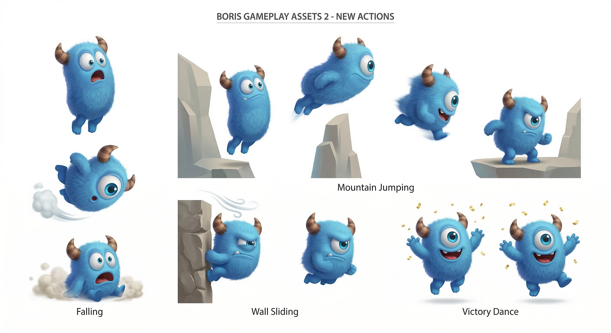
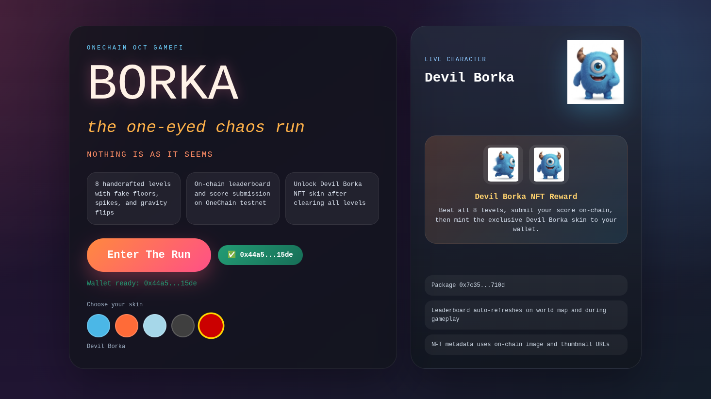
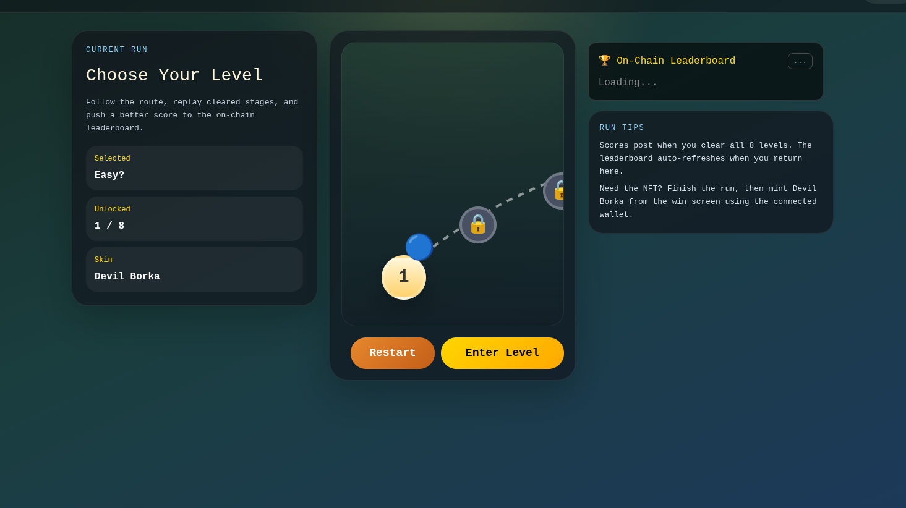
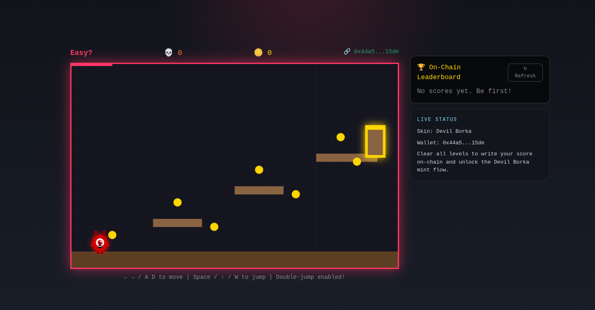
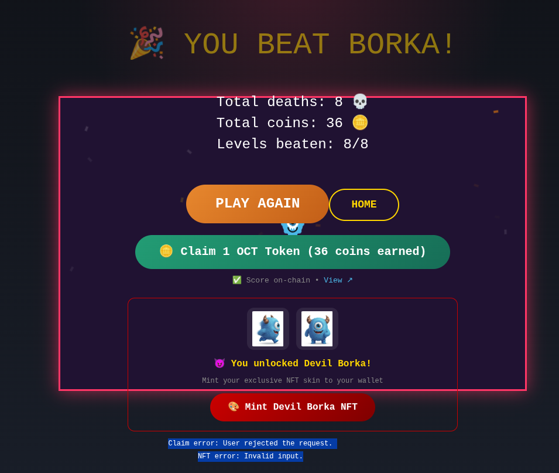

<div align="center">

# 🎮 BORKA — GameFi on OneChain

> *A deceptive little platformer that rewards skill, punishes trust, and records your glory permanently on the blockchain.*



[](https://onescan.cc/testnet)
[](https://react.dev)
[](https://move-language.github.io/move/)
[](./LICENSE)

</div>

---

## 👾 What is BORKA?

BORKA is a browser-based platformer that lives at the intersection of retro arcade fun and modern blockchain technology. You play as **Borka** — a deceptively cute creature navigating 8 increasingly evil levels packed with traps, fake platforms, gravity flips, and closing walls.

But here's the twist: **your score lives forever on the blockchain.** Beat all 8 levels with a wallet connected and your run is submitted on-chain — coins collected, deaths, time — immutable and public for everyone to see on the OneChain Testnet Leaderboard.

Win it all and you unlock the exclusive **Devil Borka NFT skin**, minted directly to your wallet.

---

## 🧑‍🎨 Meet the Characters

<div align="center">

| Devil Borka (NFT Skin) | Borka 2 | Borka 3 |
|:---:|:---:|:---:|
|  |  |  |
| Unlocked by beating all 8 levels & minting the NFT | Classic skin variant | Fire variant |

</div>

The **Devil Borka** skin is special — it's not just cosmetic. It's an on-chain NFT (`BorkaSkinNFT`) minted directly to your wallet after you conquer all 8 levels. One mint per wallet address, enforced by the smart contract.

---

---

## � Game Screenshots

Here's what the full game flow looks like — from the moment you land to the win screen:

<div align="center">

| 🏠 Home Screen | 🗺️ Level Select |
|:---:|:---:|
|  |  |
| *Connect your wallet and jump in* | *The world map — pick your stage* |

| 🎮 In-Game Action | 🏆 Win / Result Screen |
|:---:|:---:|
|  |  |
| *Dodge traps and collect coins mid-run* | *Score on-chain, claim reward, mint NFT* |

</div>

---

## 🕹️ Gameplay

### Controls

| Action | Keys |
|--------|------|
| Move Left | `←` / `A` |
| Move Right | `→` / `D` |
| Jump | `Space` / `↑` / `W` |
| Double Jump | Press jump again mid-air |

### The Core Loop

```
Start → Choose Level → Survive Traps → Collect Coins → Reach Exit
        ↑                                                       ↓
        └──────────────── Die, Respawn, Try Again ←────────────┘

After Level 8: Score submitted on-chain → Claim Reward → Mint NFT
```

### Scoring Formula

```
Final Score = (Coins × 100) − (Deaths × 50)
```

Time is also tracked and stored on-chain. The more coins you grab and the fewer times you die, the higher you climb the leaderboard.

---

## 🗺️ The 8 Levels

Each level has a personality — and a nasty surprise.

| # | Name | Signature Mechanic |
|---|------|-------------------|
| 1 | **Easy?** | Floor drops away under your feet mid-run |
| 2 | **Watch Your Step** | Rising spikes and moving spike hazards |
| 3 | **Trust Issues** | Fake platforms that fall when you land |
| 4 | **Keep Moving** | Moving platforms shifting in all directions |
| 5 | **Down Is Up** | Gravity reverses when you cross a trigger zone |
| 6 | **Speed Run** | Every platform crumbles the moment you touch it |
| 7 | **Closing In** | A wall drives you forward while spikes drop from the ceiling |
| 8 | **Devil's Den** | All of the above. At the same time. Good luck. |

Every level has 7 coins hidden across the route. Coin-hunting is dangerous but the leaderboard rewards it.

---

## ⛓️ OneChain & Smart Contract

### Why OneChain?

BORKA runs on [OneChain](https://onelabs.cc) — a high-performance, Move-based blockchain network. We chose it because:

- **Instant finality** — score submissions confirm in seconds
- **Move language** — type-safe, resource-oriented smart contracts
- **Low fees** — players can submit scores and mint NFTs without worrying about gas costs
- **OneWallet compatible** — seamless browser wallet experience

### Deployed Contract — Testnet

| Object | Address |
|--------|---------|
| 📦 **Package ID** | `0x7c358897ac2c98bed32a1f3148e99e7e6b5aee9ca8be671988a353682e31710d` |
| 🏆 **Leaderboard Object** | `0xb327c4cce2fea39c812692a9df63742aa2582a83e6c0955da6c4506849de2987` |
| 🎨 **Mint Registry Object** | `0x5823bdfdf319242d19fcaf4fb41cd7eb89c91b8673007fda8ff0361d1e6c7c96` |
| 🌐 **Network** | OneChain Testnet |
| 🔍 **Explorer** | [onescan.cc/testnet](https://onescan.cc/testnet) |

> View the contract live on the explorer by searching any of the addresses above at [onescan.cc/testnet](https://onescan.cc/testnet).

---

## 📜 Smart Contract Architecture

The contract is written in **Move** and lives at `contracts/sources/borka_game.move`.

### Shared On-Chain Objects

```
Package Init
    ├── Leaderboard (shared) ── stores up to 100 ScoreEntry records
    └── MintRegistry (shared) ── tracks which wallets have minted the NFT
```

### Stored Data Types

```move
struct ScoreEntry has store, copy, drop {
    player:  address,   // wallet address
    coins:   u64,       // coins collected across all 8 levels
    deaths:  u64,       // total deaths in the run
    time_ms: u64,       // total elapsed time in milliseconds
}

struct BorkaSkinNFT has key, store {
    id:            UID,
    skin_id:       u64,    // 4 = Devil Borka
    owner:         address,
    name:          String,
    description:   String,
    image_url:     String,
    thumbnail_url: String,
}
```

### Entry Functions

#### `submit_score` — Record your run on-chain
```move
public entry fun submit_score(
    board:   &mut Leaderboard,
    coins:   u64,
    deaths:  u64,
    time_ms: u64,
    ctx:     &mut TxContext,
)
```
- Reads the caller address from `TxContext`
- Removes any previous entry from the same wallet (one entry per address)
- Caps total entries at 100
- Pushes the new score and emits a `ScoreSubmitted` event

#### `claim_tokens` — Record your reward claim on-chain
```move
public entry fun claim_tokens(
    board: &mut Leaderboard,
    ctx:   &mut TxContext,
)
```
- Emits a `TokensClaimed` event with `amount: 1`
- This is an on-chain proof-of-claim record. Actual OCT delivery is handled off-chain.

#### `mint_devil_borka` — Mint your exclusive NFT
```move
public entry fun mint_devil_borka(
    registry:      &mut MintRegistry,
    name:          String,
    description:   String,
    image_url:     String,
    thumbnail_url: String,
    ctx:           &mut TxContext,
)
```
- Checks the registry: **one mint per wallet, enforced on-chain** — trying to mint twice aborts with error
- Creates a `BorkaSkinNFT` object and transfers it to the caller
- Emits an `NftMinted` event

### On-Chain Events

| Event | Triggered By | Fields |
|-------|-------------|--------|
| `ScoreSubmitted` | `submit_score` | `player`, `coins`, `deaths`, `time_ms` |
| `TokensClaimed` | `claim_tokens` | `player`, `amount` |
| `NftMinted` | `mint_devil_borka` | `player`, `skin_id` |

---

## 🔗 Frontend Chain Integration

The blockchain layer is cleanly separated from the game engine:

```
src/
├── lib/onechain.js          ← RPC URL, package/object IDs, helper functions
├── hooks/useOneChain.js     ← Transaction builders (submit_score, claim_tokens, mint_devil_borka)
├── components/Leaderboard.jsx ← Reads leaderboard object, sorts & renders top 10
└── contexts/WalletContext.js  ← Wallet connect/disconnect state
```

The game can be played completely without a wallet. Blockchain features (score submission, claim, NFT mint) are presented only when a wallet is connected.

---

## 🚀 Getting Started

### Play Locally

```bash
# Clone the repo
git clone https://github.com/your-org/Borka-OneChain.git
cd Borka-OneChain

# Install frontend dependencies
cd frontend
npm install

# Start the dev server
npm start
```

Open [http://localhost:3000](http://localhost:3000) in your browser.

> **First time?** Install [OneWallet](https://onelabs.cc) browser extension and switch to Testnet before connecting.

### Production Build

```bash
cd frontend
npm run build
# Output is in frontend/build/ — ready to deploy to any static host
```

### Environment Variables

The `.env` in `frontend/` is pre-configured for the deployed testnet contract:

```env
REACT_APP_BACKEND_URL=https://borka-game.preview.emergentagent.com
REACT_APP_ONECHAIN_RPC=https://rpc-testnet.onelabs.cc:443
REACT_APP_ONECHAIN_NETWORK=testnet
REACT_APP_ONECHAIN_EXPLORER=https://onescan.cc/testnet

REACT_APP_PACKAGE_ID=0x7c358897ac2c98bed32a1f3148e99e7e6b5aee9ca8be671988a353682e31710d
REACT_APP_LEADERBOARD_ID=0xb327c4cce2fea39c812692a9df63742aa2582a83e6c0955da6c4506849de2987
REACT_APP_MINT_REGISTRY_ID=0x5823bdfdf319242d19fcaf4fb41cd7eb89c91b8673007fda8ff0361d1e6c7c96
```

### Re-Deploying the Contract

```bash
# Build
cd contracts
one move build --force

# Publish
one client publish --gas-budget 500000000
```

After publishing, update the three `REACT_APP_*_ID` values in `frontend/.env` and rebuild.

See [DEPLOYMENT_GUIDE.md](./DEPLOYMENT_GUIDE.md) for the full step-by-step walkthrough including wallet import and CLI setup.

---

## 🔭 Future Scope

BORKA v1 is just the beginning. Here's where we're taking this:

### 🌐 Multiplayer — Race to the Finish
> Real-time head-to-head platformer races. Two wallets, same level, same traps — first to the exit wins. All race outcomes recorded on-chain.

- Live presence via WebSocket relay
- On-chain wager and reward distribution through a dedicated `race_escrow` contract
- Spectator mode with live leaderboard updates

### 🤖 AI vs. Humans
> Train a reinforcement learning agent on BORKA's trap patterns, then let players challenge it.

- AI agent runs the same levels with the same physics
- Human scores compared against AI benchmark scores on-chain
- Special "Beat the Bot" NFT for players who outperform the AI

### 🗺️ 100+ Unique Levels
> Currently 8 levels. The roadmap expands to **100+ procedurally-enhanced levels** with:

| Feature | Description |
|---------|-------------|
| **New Trap Types** | Laser beams, teleporters, wind zones, ice physics |
| **Environmental Hazards** | Lava floors, flood timers, collapsing ceilings |
| **Boss Encounters** | End-of-world bosses with multi-phase attack patterns |
| **Level Editor** | Community-created levels submitted on-chain as Move objects |
| **Daily Challenge Levels** | Rotating single-life levels with OCT jackpot rewards |

### 🏅 On-Chain Token Economy
> A proper `$OCT` reward distribution contract:

- Smart contract treasury holds reward pool
- `claim_tokens` evolves to trigger real `$OCT` transfers
- Seasonal ranked seasons with on-chain prize distribution
- Staking mechanism: lock `$OCT` to unlock exclusive skins

### 🎮 Platform Expansion
- **Mobile** — Touch-optimized layout already partially built
- **Controller support** — Gamepad API integration
- **Embedded Twitch/YouTube** — Stream with live wallet leaderboard overlay

---

## 🗂️ Repository Layout

```text
Borka-OneChain/
├── contracts/
│   ├── Move.toml                    ← Package manifest
│   └── sources/
│       └── borka_game.move          ← The smart contract
├── frontend/
│   ├── .env                         ← Contract addresses & RPC config
│   ├── public/
│   │   ├── 1                        ← Devil Borka NFT art
│   │   ├── 2.png                    ← Borka character skin 2
│   │   └── 3.png                    ← Borka character skin 3
│   └── src/
│       ├── components/
│       │   ├── BorkaGame.jsx        ← Main game engine + all screens
│       │   ├── Leaderboard.jsx      ← On-chain leaderboard component
│       │   └── WalletButton.jsx     ← Wallet connect/disconnect UI
│       ├── contexts/
│       │   └── WalletContext.js     ← Wallet state provider
│       ├── hooks/
│       │   └── useOneChain.js       ← Transaction hooks + leaderboard fetch
│       └── lib/
│           └── onechain.js          ← Chain config & utility functions
├── DEPLOYMENT_GUIDE.md
└── README.md
```

---

## 🙋 FAQ

**Q: Do I need a wallet to play?**  
A: No. You can play all 8 levels without a wallet. You just won't be able to save your score to the leaderboard or mint the NFT.

**Q: What wallet do I need?**  
A: [OneWallet](https://onelabs.cc) — a browser extension wallet for OneChain. Switch it to Testnet before connecting.

**Q: Is this on mainnet?**  
A: Currently on OneChain Testnet. No real tokens are required.

**Q: The leaderboard shows empty — is that a bug?**  
A: If nobody has posted a score yet, it genuinely will be empty. If you see a "Could not load" error, your RPC connection may be failing — hit the Retry button.

**Q: I got "User rejected the request" — what happened?**  
A: That just means you closed the wallet popup without signing. Click the button again and approve in your wallet.

**Q: Can I mint the Devil Borka NFT twice?**  
A: No. The `MintRegistry` contract enforces one mint per wallet address. A second attempt will fail with an on-chain assertion error.

---

## 👥 Credits

Built with ❤️ on OneChain for the **GameFi ecosystem**.

- **Game Engine**: Custom Canvas API platformer — zero external game library dependencies
- **Blockchain**: OneChain Move smart contracts + `@onelabs/dapp-kit`
- **UI**: React 18 + pure CSS (no component library)

---

## 📄 License

MIT © 2025 Borka-OneChain Contributors
